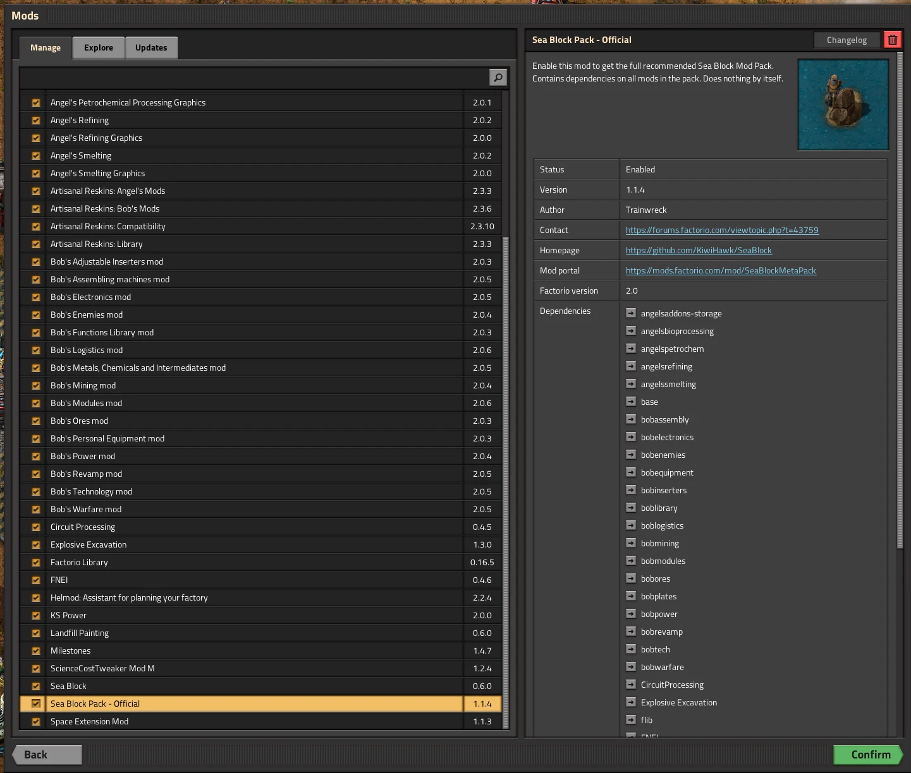

# Installation

Use this page to get a clean, known-good Sea Block 2.0 install before you begin a long save.

## Read this if...

- Sea Block does not appear where you expect in new game flow.
- You are unsure if your version/mod set matches current guides.
- You want a fast preflight checklist before starting a run.

## Clean install path

1. **Install Factorio (stable)**
   - Download from [factorio.com](https://factorio.com/).
2. **Install Sea Block pack**
   - Use [Sea Block Pack - Official](https://mods.factorio.com/mod/SeaBlockMetaPack) from Mod Portal or in-game mods.
3. **Let dependencies resolve**
   - Keep required Bob's/Angel's/support dependencies enabled.
4. **Launch once and validate**
   - Return to menu after first load so startup changes fully apply.
5. **Create a new Sea Block game**
   - Select Sea Block scenario/preset flow for your first baseline save.

## 5-minute verification checklist

- [ ] Factorio version is current stable and matches your intended guide assumptions.
- [ ] Mod list contains official Sea Block pack and required dependencies.
- [ ] No optional mods enabled yet (baseline first, then add QoL mods later).
- [ ] New game start behaves like Sea Block (tiny island/ocean start assumptions).
- [ ] Early tutorial/progression expectations are visible in your first save.

## Success indicators

- New game starts with expected Sea Block conditions (no normal ore patches).
- Recipes and early progression feel internally consistent with current docs.
- You can begin first resource loops without unexplained missing unlocks.

Install verification screenshot

<figure>
  
  <figcaption>Expected view: Sea Block pack + version checks in one frame.</figcaption>
</figure>

## If anything looks wrong

- Install/version mismatch: [Troubleshooting: Install and version mismatch](/troubleshooting/install-and-version-mismatch)
- Missing recipes/settings drift: [Troubleshooting: Missing recipe and mod settings](/troubleshooting/missing-recipe-and-mod-settings)
- Wrong map/ocean start: [Troubleshooting: Map generation and ocean issues](/troubleshooting/map-generation-and-ocean-issues)

## Next steps

- Continue to [First Steps](/getting-started/first-steps) for your first 30 minutes.
- If your baseline is stable, use [Guides](/guides/) to choose your progression path.

## Sources and attribution

Last verified: 2026-03-16

- [Sea Block Pack - Official (Mod Portal)](https://mods.factorio.com/mod/SeaBlockMetaPack)
- [Sea Block FAQ (Mod Portal)](https://mods.factorio.com/mod/SeaBlock/faq)
