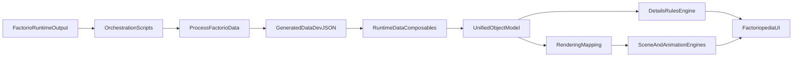

# Architecture Brief

This brief describes how SeaBlock data flows from extraction to the Factoriopedia UI, and where production-critical boundaries exist.
For a deeper pipeline review with prioritized remediation actions, see `docs/governance/factorio-data-pipeline-review.md`.

## Document Control

- **Owner area**: Runtime and Data Pipeline maintainers
- **Review cadence**: Quarterly, or after major pipeline/schema refactors
- **Acceptance criteria**:
  - Component list reflects current runtime + pipeline boundaries.
  - Data-flow diagram matches active source-of-truth paths.
  - Production-critical boundaries map to real enforcement points (CI/tests/contracts).

## System Components

- **Data extraction and orchestration**: `scripts/orchestrate-factorio-processing.js`, extraction scripts, and graphics copy/convert scripts.
- **Core transformation pipeline**: `scripts/process-factorio-data.js` generates runtime artifacts in `generated/data/dev/`.
- **Tooltip derivation pipeline**: `scripts/generate-tooltips.js` computes `en-tooltips.json` using the same rules framework used by runtime details rendering.
- **Runtime data composables**: `src/composables/useFactorioData.js`, `src/composables/useUnifiedObjects.js`, `src/composables/useFactorioPrototypeMapping.js`.
- **Details rules engine**: `src/composables/useDetailsData/rulesEngine.js` and type-specific rules in `src/composables/useDetailsData/`.
- **Rendering engines**: `src/components/FactorioAnimationEngine.js`, `src/components/FactorioSceneEngine.js`, and rendering mapping in `src/composables/useFactorioRenderingMapping.js`.
- **VitePress presentation layer**: `docs/.vitepress/components/Factoriopedia.vue`, `docs/.vitepress/components/DetailsPane.vue`.

## Data Flow

## Production-Critical Boundaries

- **Boundary A - data contract generation**: `scripts/process-factorio-data.js` is the source of truth for generated runtime datasets and icon/spritemap contracts.
- **Boundary B - type mapping correctness**: `src/composables/useFactorioPrototypeMapping.js` and `src/composables/useFactorioData.js` determine how raw prototypes are grouped for all downstream behavior.
- **Boundary C - details fidelity**: `src/composables/useDetailsData/` controls tooltip/statistics parity with Factorio semantics.
- **Boundary D - visual rendering behavior**: `src/composables/useFactorioRenderingMapping.js` and render engines determine whether entities/tiles animate and compose correctly.

## Coupling and Risk Notes

- `useFactorioData` and details rules rely on stable keys and schema from generated files in `generated/data/dev/`; schema drift can silently break UI behavior.
- The monolithic UI surface in `docs/.vitepress/components/DetailsPane.vue` increases regression risk for unrelated edits.
- Debug and global side effects currently leak into runtime (`window.structure`, resize observer on `window`, direct console/debugger usage in runtime engines).

## Sources and attribution

Last verified: 2026-03-16

- SeaBlock in-repo documentation and linked project pages.
- Official Sea Block mod portal resources and community references, where applicable.
