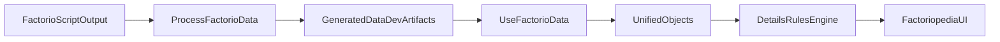

# Factorio Data Pipeline Review

This review documents the current Factorio data processing pipeline, data contracts, known failure/quality risks, and a prioritized improvement path.

## Document Control

- **Owner area**: Pipeline and Runtime maintainers
- **Audience**: Platform maintainers and developers (Track B)
- **Target location**: `docs/governance` (under `docs/`)
- **Review cadence**: After schema or pipeline changes
- **Scope**: Extraction/orchestration scripts, processing pipeline, runtime loading, and details-rule coupling

## Pipeline Process

The pipeline forms a **fork**: Processor chain (Extract → Process → Tooltips) and Graphics chain (copy-mod-graphics → WebP → Cloudflare) are independent. They share output folder `generated/data/dev`. See `scripts/README.md`.

### 1) Extraction and Orchestration

- Entry point: `extract-factorio-data.sh` / `.ps1`
- Extraction step runs Factorio dump commands:
  - `--dump-data`
  - `--dump-prototype-locale`
  - `--dump-icon-sprites`
- The processing step invokes `scripts/process-factorio-data.js` with `--script-output`.

### 2) Core Processing

- Entry point: `scripts/process-factorio-data.js`
- Loads:
  - `data-raw-dump.json`
  - `*-locale.json` files
- Processes prototype buckets, tracks type hierarchy/mapping, resolves icons, deduplicates identical icons, and packs sprites into an atlas.
- Produces JSON and sprite assets in `generated/data/dev/`.

### 3) Runtime Consumption

- Entry point: `src/composables/useFactorioData.js`
- Loads `data.json` and `locale-{lang}.json`, then organizes and localizes prototype data.
- Runtime details rendering depends on:
  - `src/composables/useUnifiedObjects.js`
  - `src/composables/useDetailsData/rulesEngine.js`
  - `src/composables/useDetailsData/*Rules.js`

## Data Contract (Generated Artifacts)

Generated by `scripts/process-factorio-data.js`:

- `generated/data/dev/data.json`
  - Top-level keys are prototype categories.
  - Each category contains `{ [prototypeName]: prototypeData }`.
- `generated/data/dev/locale-{lang}.json`
  - Compact localized structure:
  - `locale[type][name].n` for display name
  - `locale[type][name].d` for description
- `generated/data/dev/type-mapping.json`
  - Contains `categoryMapping` and `typeHierarchy`.
- `generated/data/dev/spritemap.json`
  - Atlas metadata with image dimensions and sprite coordinates.
- `generated/data/dev/spritemap.png`
  - Atlas image.

## Failure Handling and Assumptions

- Missing `--script-output` fails fast.
- Raw dump parse failures are fatal.
- Locale file parse failures are logged and skipped per-file.
- Missing icon files and some image-processing issues are non-fatal (warning path).
- Spritemap generation failure is fatal.
- Processing defaults to English locale unless `--locale` is passed explicitly.

## Findings and Risk Prioritization

### P0 Correctness

1. Runtime loader key consistency hardening opportunity in `src/composables/useFactorioData.js`.
   - Loader now uses singular/plural fallback lookups, but contract assumptions still need explicit helper-level tests.
   - Impact: lower immediate risk than before, but potential regression risk during future refactors.

2. `loadAllData()` race/deduping gap in `src/composables/useFactorioData.js`.
   - Concurrent loads/language switches can overwrite shared singleton state.
   - Impact: stale or mixed language/data state.

### P1 Resilience

1. Rule null-safety gaps in `src/composables/useDetailsData/recipeRules.js`.
   - `technology.unit?.ingredients.length` should guard the nested property.
   - Unlock section may render empty payloads.
   - Comma operator usage (`items: (technology.name, items)`) reduces clarity and risks mistakes.

2. Runtime global side effects in `src/composables/useFactorioData.js`.
   - `window.structure` export leaks mutable state into global scope.

### P1/P2 Performance and Maintainability

1. Heavy synchronous IO and sequential image handling in `scripts/process-factorio-data.js`.
   - Frequent sync file operations and sequential metadata/resize operations increase processing time for large datasets.

2. Monolithic pipeline files.
   - `scripts/process-factorio-data.js` remains large and cross-cutting, increasing regression surface.

## Prioritized Improvement Matrix

| Priority | Improvement | Impact | Effort | Target files |
| --- | --- | --- | --- | --- |
| P1 | Finalize loader key contract and helper lookups with tests | Medium | Small | `src/composables/useFactorioData.js` |
| P0 | Add in-flight load dedupe/race protection in loader | High | Medium | `src/composables/useFactorioData.js` |
| P1 | Harden unlock-technologies rule null checks and empty-section filtering | Medium | Small | `src/composables/useDetailsData/recipeRules.js` |
| P1 | Remove runtime global side effects | Medium | Small | `src/composables/useFactorioData.js`, `docs/.vitepress/components/Factoriopedia.vue` |
| P1/P2 | Reduce sync-IO hotspots and add bounded image concurrency | Medium/High | Medium/Large | `scripts/process-factorio-data.js` |
| P2 | Modularize pipeline scripts by concern | Medium | Large | `scripts/process-factorio-data.js` |
| P2 | Add artifact schema contract checks in CI/local validation | Medium | Medium | `scripts/process-factorio-data.js`, `generated/data/dev/*.json`, test/validation scripts |

## Improvement Backlog

### Immediate Hardening (Now)

- Add helper-level tests that lock loader key contract behavior in `src/composables/useFactorioData.js`.
- Add request deduping/race protection in `loadAllData()` and reset strategy for reprocessing.
- Harden recipe unlock rule null checks and post-condition filtering in `src/composables/useDetailsData/recipeRules.js`.
- Remove global runtime side effects such as `window.structure`.

### Near-Term Refactors (Next)

- Split `scripts/process-factorio-data.js` by concerns:
  - input loading/parsing
  - prototype transformation
  - icon dedupe/atlas generation
  - artifact writers
- Add contract assertions/tests for generated artifacts (`data.json`, `locale-{lang}.json`, `type-mapping.json`, `spritemap.json`).

### Longer-Term Optimization (Later)

- Introduce bounded-concurrency image metadata and resize pipeline.
- Reduce sync-IO usage in hot loops where it does not simplify control flow.
- Consider incremental/lazy runtime loading strategy for very large data payloads.

## Validation Checklist

- Run `npm run lint`.
- Run `npm run build`.
- Regenerate artifacts with processing scripts and verify:
  - expected files are produced
  - schema contracts remain stable
  - runtime pages render and details sections remain consistent.

## Sources and attribution

Last verified: 2026-03-16

- SeaBlock in-repo documentation and linked project pages.
- Official Sea Block mod portal resources and community references, where applicable.
