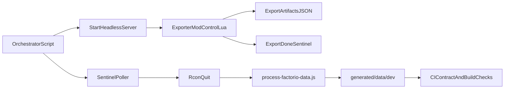

# Headless Export CI/CD Plan

This document defines a future-state implementation plan for replacing locale `.cfg` fallback behavior with a headless Factorio export flow that emits authoritative JSON artifacts for the SeaBlock site pipeline.

This work is one track in a wider initiative to run the full asset pipeline (`export -> processing -> contract validation -> publish`) inside CI/CD so generated data is reproducible, gated, and deploy-safe.

## Document Control

- **Owner area**: Pipeline and Platform maintainers
- **Review cadence**: After any extraction contract or CI workflow change
- **Scope**: Factorio-side export execution, orchestrator handshake, artifact contracts, CI/CD rollout

## Problem Statement

Current extraction relies on built-in dump commands and a Node fallback that reads locale `.cfg` data from Factorio/mod files. This creates portability and maintenance overhead, especially when running automated builds.

Goals for the replacement path:

- Remove `.cfg` parsing as a correctness dependency.
- Keep extraction portable across local and CI environments.
- Make export completion deterministic and machine-controllable.
- Establish artifact contract validation in CI before deploy.
- Converge local and CI execution paths so the same end-to-end pipeline drives release assets.

## Proposed Future-State Architecture

The extraction process runs Factorio as a headless server session with an exporter mod/scenario enabled. The exporter writes JSON and a completion sentinel into `script-output`. Orchestration waits for the sentinel and then cleanly stops the server over RCON.

## Factorio-Side Execution Model

### Startup Strategy

- Prefer server startup via scenario entrypoint:
  - `--start-server-load-scenario [MOD/]SCENARIO_NAME`
- Avoid dependence on a portable save artifact as a required input.
- Use a dedicated exporter mod/scenario that runs export logic on `on_init` (or first tick guard).

### Exporter Responsibilities (`control.lua`)

- Gather required prototype/localization payloads for downstream processing.
- Resolve and emit localized strings required by the UI, including `factoriopedia_description`.
- Write deterministic JSON files into `script-output`.
- Write a final sentinel file only after all required JSON files are complete.

Recommended file outputs:

- `export-manifest.json`: metadata and schema/version contract.
- `prototype-locale-export.json` (or per-type locale JSON files).
- `export-errors.json` when a recoverable export issue occurs.
- `export-done.json` sentinel for orchestration handshake.

Recommended manifest fields:

- `schemaVersion`
- `factorioVersion`
- `modSetFingerprint` (hash/fingerprint of active mods)
- `language`
- `runId`
- `counts` (per-type record counts)

## Orchestrator Control Loop

### Launch

- Start headless server with:
  - enabled exporter mod/scenario
  - RCON configured (`--rcon-port`, `--rcon-password`)
  - deterministic run identifier (`runId`) passed via config or agreed file

### Poll-and-Stop Handshake

1. Delete stale sentinel files before launch.
2. Poll for `export-done.json` under `script-output` with timeout.
3. Validate sentinel:
   - `ok === true`
   - `runId` matches expected run
   - required artifact files exist
4. Send `/quit` via RCON.
5. Wait for clean process exit; fail if exit is non-zero.

Timeout or failure path:

- Attempt RCON `/quit` first.
- If unavailable, terminate process and mark run failed.
- Persist logs and `export-errors.json` for diagnostics.

## Artifact Contract for Node Processing

`scripts/process-factorio-data.js` should evolve to:

- consume exporter JSON as primary source for localized fields.
- stop depending on `.cfg` scanning/parsing fallback paths.
- enforce `schemaVersion` compatibility before processing.

Transitional strategy:

- Phase A: dual-path support (export JSON preferred, `.cfg` fallback retained behind warning).
- Phase B: parity validation and diff checks.
- Phase C: remove `.cfg` codepaths and related extraction assumptions.

## CI/CD Integration Plan

This plan intentionally targets end-to-end CI/CD ownership of generated assets, not only extraction. The headless export handshake is the entry point that enables a fully automated `export -> process -> validate -> publish` workflow.

### Pipeline Stages

1. **Extract**
   - Launch headless export session.
   - Enforce sentinel timeout and manifest validation.
2. **Process**
   - Run `scripts/process-factorio-data.js` against generated `script-output`.
3. **Validate**
   - Run schema checks for generated files in `generated/data/dev`.
   - Run lint/build/tests.
4. **Publish**
   - Deploy only if extraction + processing + validation pass.

### CI Requirements

- Factorio binary and mods available in runner environment.
- Stable writable `script-output` path.
- Secure RCON credentials injected through CI secrets.
- Artifact retention for:
  - exporter JSON files
  - sentinel/manifest files
  - server logs
  - processed `generated/data/dev` outputs

### Suggested Quality Gates

- Reject runs where:
  - sentinel missing or malformed
  - manifest `schemaVersion` unsupported
  - required exported files missing
  - generated data contract validation fails
- Compare key localized outputs against baseline fixtures for parity-critical types.

## Implementation Milestones

1. **Exporter Prototype**
   - Create exporter mod/scenario and write minimal manifest + sentinel.
2. **Handshake Integration**
   - Add orchestrator start/poll/RCON-stop path.
3. **JSON Contract Expansion**
   - Emit required localized fields for downstream parity.
4. **Processor Migration**
   - Consume exporter JSON as primary source.
5. **Fallback Retirement**
   - Remove `.cfg` parsing path after parity confidence.
6. **CI Enforcement**
   - Add extraction and contract gates to deployment workflow.

## Risk Register

- **Server lifecycle drift**: orphaned server process if timeout handling is incomplete.
- **Stale sentinel false positives**: mitigated by `runId` matching and pre-run cleanup.
- **Schema drift**: mitigated by explicit `schemaVersion` checks.
- **Localization parity regressions**: mitigated by baseline parity tests and phased fallback removal.

## Operational Runbook Notes

- Keep extraction logs and manifest files as first-class CI artifacts.
- Prefer failing fast on contract mismatch rather than silently degrading output.
- Treat exporter schema changes as governance-level changes requiring review updates.
