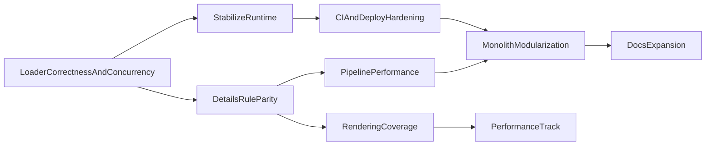

# Wiki Platform Roadmap

This roadmap tracks engineering execution for the wiki platform (pipeline, runtime, CI/CD, and architecture).

## Document Control

- **Owner area**: Governance maintainers with Runtime/DocsUI input
- **Audience**: Platform maintainers and developers (Track B)
- **Target location**: `docs/governance` (under `docs/`)
- **Review cadence**: Monthly
- **Update trigger**: Any major workflow, contract, or architecture change

## Method

- Sources include:
  - Governance artifacts in `docs/governance/`
  - Runtime and pipeline hotspots in `src/` and `scripts/`
  - TODO markers in `src/` and `docs/.vitepress/components/`
- Horizon model:
  - **Now**: 0-1 month (stability/unblockers)
  - **Next**: 1-3 months (feature completion and correctness)
  - **Later**: 3+ months (polish and expansion)

## Now (0-1 Month)

1. **Fix runtime loader correctness and concurrency**
   - Add request dedupe/race protection in data loading and lock loader key-contract behavior with focused helper tests.
   - Source evidence: `src/composables/useFactorioData.js`.

2. **Stabilize runtime/debug behavior**
   - Keep diagnostics controlled in production paths and remove residual non-actionable runtime logs.
   - Source evidence: `src/components/FactorioSceneEngine.js`, `src/composables/useFactorioData.js`, `src/composables/useFactorioPrototypeMapping.js`.

3. **Close highest-impact details-rule gaps**
   - Implement missing unlock/effect/research-derived values and null-safety hardening in details rules.
   - Source evidence: `src/composables/useDetailsData/recipeRules.js`, `src/composables/useDetailsData/entityRules.js`, `src/composables/useDetailsData/technologyRules.js`.

4. **Harden deploy and validation gates**
   - Restrict deploy triggers and add required lint/build checks in workflow sequence.
   - Source evidence: `.github/workflows/deploy.yml`, `docs/governance/developer-guidelines.md`.

5. **Document and enforce generated data contract**
   - Formalize expectations for `generated/data/dev/*.json` and schema-impact change process.
   - Source evidence: `scripts/process-factorio-data.js`, `docs/governance/developer-guidelines.md`, `docs/governance/factorio-data-pipeline-review.md`.

6. **Prototype end-to-end CI asset pipeline**
   - Implement server-mode exporter handshake (sentinel + RCON quit) as part of automating the full `export -> processing -> validation -> publish` path, and define migration gates away from `.cfg` fallback paths.
   - Source evidence: `docs/governance/headless-export-cicd-plan.md`, extraction scripts, `scripts/process-factorio-data.js`.

## Next (1-3 Months)

1. **Improve pipeline processing performance**
   - Reduce synchronous hot-loop IO and introduce bounded concurrency in icon metadata/resize pipeline.
   - Source evidence: `scripts/process-factorio-data.js`.

2. **Improve rendering mapping coverage**
   - Complete critical TODOs and prototype handler coverage in rendering mapping.
   - Source evidence: `src/composables/useFactorioRenderingMapping.js`.

3. **Resolve open browser-renderer parity work**
   - Address pending custom containers/YAML enhancements and remaining parity tasks.
   - Source evidence: `docs/governance/key-issues.md`, runtime TODO markers.

4. **Modularize high-risk monolith files**
   - Extract `DetailsPane.vue` and major scripts into bounded modules.
   - Source evidence: `docs/.vitepress/components/DetailsPane.vue`, `scripts/process-factorio-data.js`.

5. **Formalize contributor standards in one entry path**
   - Consolidate contributor workflow and quality policy references from README/docs.
   - Source evidence: `README.md`, `docs/governance/editing-guidelines.md`, `docs/governance/developer-guidelines.md`.

6. **Governance artifact cleanup for platform docs**
   - Retire duplicate platform-planning artifacts and keep canonical engineering docs in `docs/`.
   - Source evidence: `docs/governance/legacy-doc-retirement.md`.

## Later (3+ Months)

1. **Performance and observability track**
   - Add benchmark-style checks for data load, details generation, and heavy render paths.
   - Source evidence: runtime render engine files and governance validation policy.

2. **Platform documentation resilience**
   - Keep architecture and pipeline docs aligned with implementation and CI gates.
   - Source evidence: `docs/governance/architecture-brief.md`, `docs/governance/developer-guidelines.md`.

3. **Roadmap automation**
   - Generate roadmap evidence snapshots from TODO markers and planning docs on a cadence.
   - Source evidence: planning docs + in-code TODO markers listed above.

## Dependencies and Sequencing

## Exit Criteria per Horizon

- **Now**: no runtime debugger statements; critical rules TODOs resolved; deploy gating updated; runtime diagnostics are development-gated.
- **Next**: key rendering and parity gaps closed; monolith decomposition started with measurable file reductions; legacy governance cleanup milestones complete.
- **Later**: recurring performance checks and roadmap refresh process established.

## Cross-Track Links

- Consumer and maintainer roadmap: [Wiki Roadmap (Consumers and Maintainers)](/reference/wiki-roadmap-consumers-maintainers)
- Consumer and maintainer issues: [Wiki Issues (Consumers and Maintainers)](/reference/wiki-issues-consumers-maintainers)

## Sources and attribution

Last verified: 2026-03-16

- SeaBlock in-repo documentation and linked project pages.
- Official Sea Block mod portal resources and community references, where applicable.
