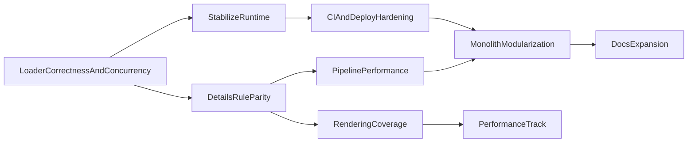

# Future Roadmap

This roadmap consolidates existing planning docs and in-code TODO signals into a single execution view.

## Document Control

- **Owner area**: Governance maintainers with Runtime/DocsUI input
- **Review cadence**: Monthly
- **Update trigger**: Any major workflow, contract, or architecture change

## Method

- Sources include:
  - Governance artifacts in `docs/governance/`
  - Runtime and pipeline hotspots in `src/` and `scripts/`
  - TODO markers in `src/` and `docs/.vitepress/components/`
- Horizon model:
  - **Now**: 0-1 month (stability/unblockers)
  - **Next**: 1-3 months (feature completion and correctness)
  - **Later**: 3+ months (polish and expansion)

## Now (0-1 Month)

1. **Fix runtime loader correctness and concurrency**
   - Normalize organized-data key usage (`recipe`/`technology` contract alignment) and add request dedupe/race protection in data loading.
   - Source evidence: `src/composables/useFactorioData.js`.

2. **Stabilize runtime/debug behavior**
   - Remove runtime `debugger` and noisy logs from production paths.
   - Source evidence: `src/components/FactorioSceneEngine.js`, `src/composables/useFactorioData.js`, `src/composables/useFactorioPrototypeMapping.js`.

3. **Close highest-impact details-rule gaps**
   - Implement missing unlock/effect/research-derived values and null-safety hardening in details rules.
   - Source evidence: `src/composables/useDetailsData/recipeRules.js`, `src/composables/useDetailsData/entityRules.js`, `src/composables/useDetailsData/technologyRules.js`.

4. **Harden deploy and validation gates**
   - Restrict deploy triggers and add required lint/build checks in workflow sequence.
   - Source evidence: `.github/workflows/deploy.yml`, `docs/governance/developer-guidelines.md`.

5. **Document and enforce generated data contract**
   - Formalize expectations for `docs/public/data/*.json` and schema-impact change process.
   - Source evidence: `scripts/process-factorio-data.js`, `docs/governance/developer-guidelines.md`, `docs/governance/factorio-data-pipeline-review.md`.

6. **Prototype end-to-end CI asset pipeline**
   - Implement server-mode exporter handshake (sentinel + RCON quit) as part of automating the full `export -> processing -> validation -> publish` path, and define migration gates away from `.cfg` fallback paths.
   - Source evidence: `docs/governance/headless-export-cicd-plan.md`, `scripts/orchestrate-factorio-processing.js`, `scripts/process-factorio-data.js`.

## Next (1-3 Months)

1. **Improve pipeline processing performance**
   - Reduce synchronous hot-loop IO and introduce bounded concurrency in icon metadata/resize pipeline.
   - Source evidence: `scripts/process-factorio-data.js`.

2. **Improve rendering mapping coverage**
   - Complete critical TODOs and prototype handler coverage in rendering mapping.
   - Source evidence: `src/composables/useFactorioRenderingMapping.js`.

3. **Resolve open browser-renderer parity work**
   - Address pending custom containers/YAML enhancements and remaining parity tasks.
   - Source evidence: `docs/governance/key-issues.md`, runtime TODO markers.

4. **Modularize high-risk monolith files**
   - Extract `DetailsPane.vue` and major scripts into bounded modules.
   - Source evidence: `docs/.vitepress/components/DetailsPane.vue`, `scripts/process-factorio-data.js`, `scripts/orchestrate-factorio-processing.js`.

5. **Formalize contributor standards in one entry path**
   - Consolidate contributor workflow and quality policy references from README/docs.
   - Source evidence: `README.md`, `docs/governance/editing-guidelines.md`, `docs/governance/developer-guidelines.md`.

6. **Documentation governance cleanup**
   - Migrate residual useful content from legacy docs, then deprecate and remove obsolete guidance files.
   - Source evidence: `docs/governance/legacy-doc-retirement.md`.
   - Milestones:
     - Inventory complete and mapped to canonical governance pages.
     - Inbound references replaced.
     - Legacy docs deleted once removal gates are satisfied.

## Later (3+ Months)

1. **Performance and observability track**
   - Add benchmark-style checks for data load, details generation, and heavy render paths.
   - Source evidence: runtime render engine files and governance validation policy.

2. **Documentation expansion and content program**
   - Continue guides/reference growth with explicit quality checklist adherence.
   - Source evidence: `README.md` content guidance sections and existing guides tree.

3. **Roadmap automation**
   - Generate roadmap evidence snapshots from TODO markers and planning docs on a cadence.
   - Source evidence: planning docs + in-code TODO markers listed above.

## Dependencies and Sequencing

## Exit Criteria per Horizon

- **Now**: no runtime debugger statements; critical rules TODOs resolved; deploy gating updated.
- **Next**: key rendering and parity gaps closed; monolith decomposition started with measurable file reductions; legacy governance cleanup milestones complete.
- **Later**: recurring performance checks and roadmap refresh process established.
